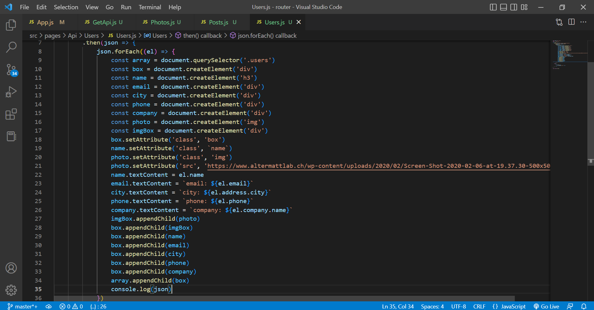

# fetch : https://madina192.github.io/fetch/
## my portfolio: https://madina192.github.io/about-me/
## click on GetAPI -> "Posts", "Photos", "Users" to get data. It's done by using fetch API
## api for posts: https://jsonplaceholder.typicode.com/posts

## api for photos: https://jsonplaceholder.typicode.com/photos

## api for users: https://jsonplaceholder.typicode.com/users

